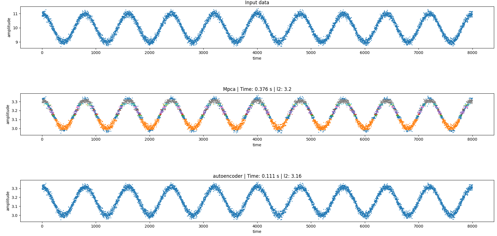
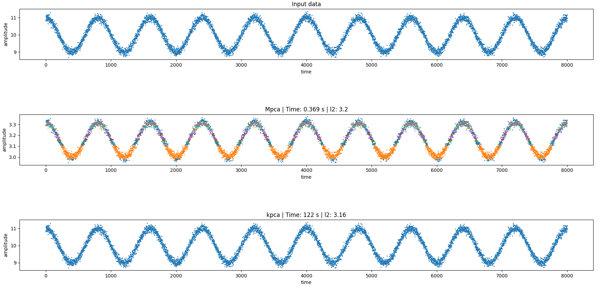

# Multi-PCA

This repository demonstrates the representation capability of the Multi-PCA from the paper ([MPCA](http://ceur-ws.org/Vol-2600/paper15.pdf)) . We use time series data and benchmark the capabilities of the Multi-PCA vs the Autoencoder and the Kernel PCA. 

The benchmarks are based on: 

 * Reconstruction error and 
 * Time Taken to reconstruct.

The python file *wave_test.py* can used to recreate all results. It takes the following arguments:

```
python3 wave_test.py [--dataset] [-clus] [--alg] [--arglist]
```

###### --dataset [-d] : the dataset that the algorithms will encode and reconstruct. The available options are: sine, cosine and rgenerated (rgenerated is randomly generated noise). The default is rgenerated. 


###### --clus [-c] : the clustering algorithm to use for Multi-PCA. Available options are db, hdb, db-hdb, kmeans (representing dbscan, hdbscan, dbscan+hdbscan, kmeans respectively). The default is hdb.

###### --alg [-a] : the algorithm to compare with the Multi-PCA. Available choices are kPCA, AE (representing kernel pca and autoencoder respectively). The default is kPCA.

###### --arglist [l]: this is a list of arguments for the clustering algorithm. It is of the format: [epsilon, min_samples, min_cluster_size, centroids]. Tamper with this only if you want to experimet. Default values are: [1e-02, 50, 100, 4].

---

## Results

The time-series data used for demonstration is a noisy cosine wave. The multi-pca is using the hdbscan clustering algorithm and is compared versus the Kernel PCA (rbf  kernel) and the Autoencoder (3 layer neural network). 


#### Versus Autoencoder




#### Versus Kernel pca (linear kernel)




---

###### The multi-pca exhibits modelling capabilities on par with kernel pca and the autoencoder  while being significantly faster. This disparity only grows with the size of the dataset. 

